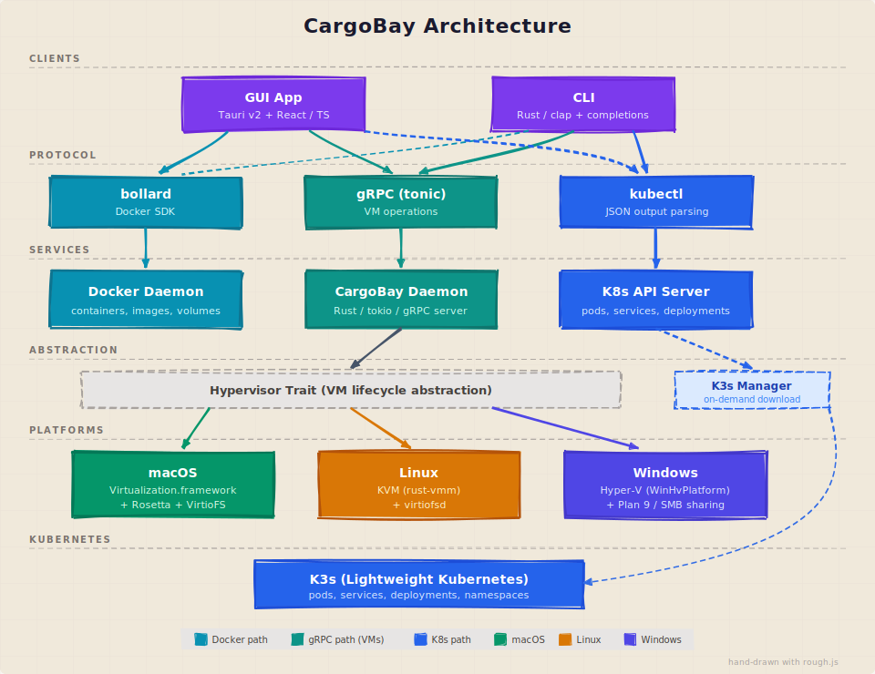

# CrateBay 技术架构

## 技术选型

| 层级 | 技术方案 | 理由 |
|------|----------|------|
| GUI | Tauri v2 + React (TypeScript) | 跨平台、轻量、GitHub 热度最高的桌面框架 |
| CLI | Rust (clap) | 与后端同语言，单二进制分发 |
| 守护进程 | Rust (tokio) | 高性能异步运行时，管理 VM 和 K3s 生命周期 |
| IPC | gRPC (tonic) | 高性能，类型安全，Rust 原生（仅用于 VM 操作） |
| 容器引擎 | Docker API (bollard) | GUI/CLI 直连 Docker socket，无额外中间层，最低延迟 |
| 虚拟化 (macOS) | Rust FFI → Swift → Virtualization.framework | macOS 原生性能 |
| 虚拟化 (Linux) | Rust → KVM (rust-vmm) | 内核级虚拟化 |
| 文件共享 | virtiofs | 近原生文件系统性能 |
| K8s | k3s (按需下载) + kubectl | 轻量级，资源占用低 |
| K8s 查询 | kubectl JSON output | GUI/CLI 直接解析 kubectl 输出，无需额外依赖 |

## 系统架构图

<p align="center">
  
</p>

## 数据流说明

### 容器/镜像/存储卷操作
```
GUI/CLI → bollard (Rust Docker client) → Docker socket → Docker daemon
```
- **不经过 CrateBay Daemon**
- 直连 Docker socket，延迟最低（~1-5ms）
- Docker 本身就是一个 daemon，无需额外中间层
- 自动检测 Docker socket 路径（Colima / OrbStack / Docker Desktop）

### VM 操作
```
GUI/CLI → gRPC → CrateBay Daemon → Hypervisor trait → 平台 VM 后端
```
- **必须经过 Daemon**（需要特权操作、复杂生命周期管理）
- Daemon 管理 VM 创建/启动/停止/删除/控制台/端口转发/VirtioFS
- Hypervisor trait 统一接口，各平台独立实现

### K3s 集群管理
```
GUI/CLI → cratebay-core::k3s::K3sManager → K3s 二进制 (按需下载)
```
- 从 GitHub releases 按需下载 K3s
- Linux 上直接运行；macOS/Windows 未来将在 VM 内运行

### K8s 仪表盘查询
```
GUI/CLI → kubectl --kubeconfig → K8s API Server
```
- 直接调用 kubectl 获取 JSON 输出
- 解析 pods/services/deployments/namespaces
- 只读查询，无状态

## Crate 结构

```
CrateBay/
├── crates/
│   ├── cratebay-core/     # 核心库：Hypervisor trait、K3s manager、
│   │                      # store、images、port forwarding
│   ├── cratebay-cli/      # CLI：直连 Docker (bollard) + gRPC → Daemon (VM)
│   ├── cratebay-daemon/   # 守护进程：仅 VM 服务 (gRPC VMService)
│   ├── cratebay-gui/      # GUI：Tauri v2 后端 + React 前端
│   │   ├── src/           #   React 前端（TS）
│   │   └── src-tauri/     #   Tauri 后端（Rust）
│   └── cratebay-vz/       # macOS Virtualization.framework FFI (Swift bridge)
├── proto/                 # gRPC 定义（仅 VMService，14 个 RPC）
└── website/               # 官方网站（GitHub Pages）
```

## 当前代码布局

- `crates/cratebay-gui/src-tauri/src/lib.rs` 现在主要保留共享应用装配、assistant 编排、测试与 Tauri 启动逻辑。
- Tauri 后端按领域拆分到 `crates/cratebay-gui/src-tauri/src/docker.rs`、`crates/cratebay-gui/src-tauri/src/vm.rs`、`crates/cratebay-gui/src-tauri/src/kubernetes.rs`、`crates/cratebay-gui/src-tauri/src/tray.rs`、`crates/cratebay-gui/src-tauri/src/ai.rs` 与 `crates/cratebay-gui/src-tauri/src/update.rs`。
- CLI 命令处理拆分到 `crates/cratebay-cli/src/runtime.rs`、`crates/cratebay-cli/src/vm.rs`、`crates/cratebay-cli/src/image.rs`、`crates/cratebay-cli/src/docker.rs`、`crates/cratebay-cli/src/volume.rs` 与 `crates/cratebay-cli/src/k3s.rs`，`crates/cratebay-cli/src/main.rs` 主要负责命令定义与入口装配。
- GUI 侧的 AI Hub 现在把页头、Models、Sandboxes、MCP 等标签页内容拆分到 `crates/cratebay-gui/src/pages/ai-hub/` 目录，`crates/cratebay-gui/src/pages/AiHub.tsx` 主要保留状态编排与命令处理。
- `crates/cratebay-gui/src/App.tsx` 现在按页面懒加载 Dashboard / AI Hub / Containers / Images / Volumes / Settings，减少首屏 bundle 体积并让桌面导航装配更清晰。
- 默认桌面导航当前只对外暴露 Dashboard、AI Hub、Containers、Images、Volumes 与 Settings。VM 和 Kubernetes 的后端代码仍保留用于后续阶段，但在专用 runtime 验证补齐前会继续从默认 GUI 中隐藏。

## 关键设计决策

1. **混合 IPC 模式** — 容器直连 Docker socket（性能优先），VM 走 gRPC Daemon（需要特权和生命周期管理）。不给 Docker 加不必要的中间层。
2. **全栈 Rust** — GUI 后端、Daemon、CLI、VM 引擎共享同一语言，减少技术栈复杂度
3. **Hypervisor trait 抽象** — 统一 VM 接口，各平台独立实现，新平台只需加一个 backend
4. **Tauri v2 做 GUI** — 比 Electron 省 60-90% 内存，比原生 GUI 省 3 倍开发成本
5. **K3s 按需下载** — 不捆绑在安装包内，减小分发体积
6. **Docker 运行时自动检测** — 支持 CrateBay Runtime（macOS 内置 socket / Windows WSL2）以及 Colima / OrbStack / Docker Desktop / 原生 Docker，无需手动配置

## Proto 定义 (仅 VM)

`proto/cratebay.proto` 定义了 `VMService`，包含 14 个 RPC：

| RPC | 用途 |
|-----|------|
| CreateVm / StartVm / StopVm / DeleteVm | VM 生命周期 |
| ListVMs / GetVmStatus | VM 查询 |
| MountVirtioFs / UnmountVirtioFs / ListVirtioFsMounts | VirtioFS 共享 |
| AddPortForward / RemovePortForward / ListPortForwards | 端口转发 |
| GetVmConsole | 串口控制台 |
| GetVmStats | 资源监控 |

容器/镜像/存储卷/K3s/K8s 操作不经过 gRPC，无对应 proto 定义。
